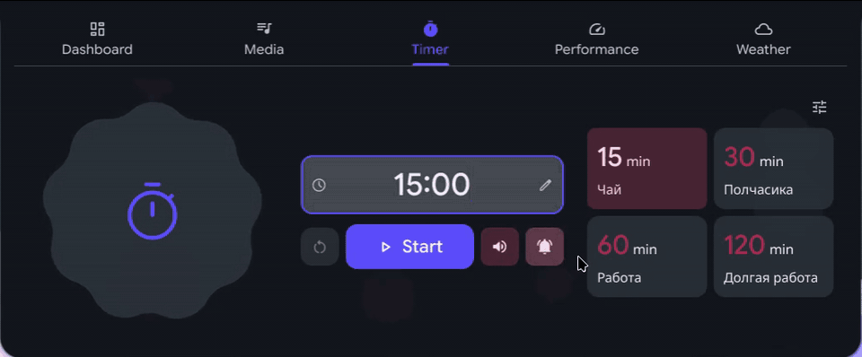
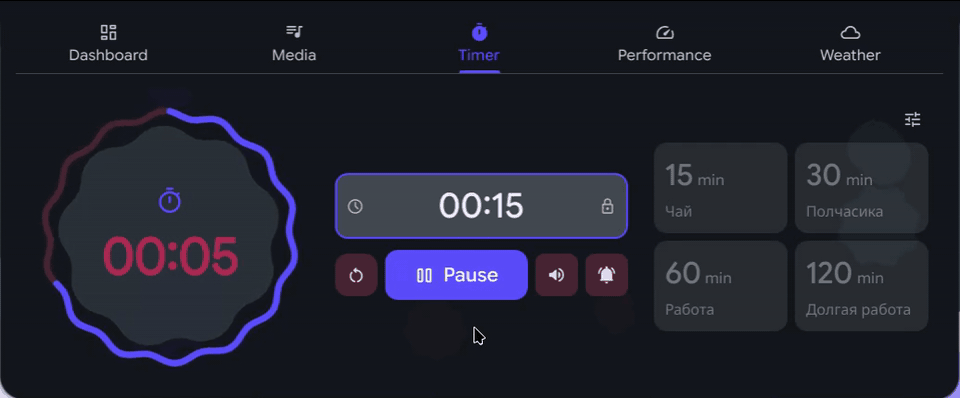

# Caelestia Timer

Таймер прямо в панели [Caelestia Shell](https://github.com/caelestia-dots/shell). Родной стиль, анимированный отсчёт — без отдельного приложения.

<p align="center">
  <a href="../LICENSE"></a>&nbsp;
  &nbsp;
  
</p>

<p align="center">
  <a href="../README.md">English</a> · Русский
</p>

## Хватит теории — что вы получите

- Отсчёт от секунды до 24 часов с паузой, продолжением и сбросом.
- Четыре пресета на 15, 30, 60 и 120 минут. Названия и время можно менять.
- Сохранение таймера и пресетов после перезапуска. Учёт времени, прошедшего во сне.
- Уведомление и мягкий звук завершения — каждый можно отключить.
- Русский и английский интерфейс, родные анимации Caelestia.



<details>
<summary>Как заканчивается отсчёт</summary>



</details>

## Установка

Нужны Caelestia, Python 3 и Bash. Проверено с **Caelestia 2.5.0 / Quickshell 0.3.1** на Hyprland.

```sh
git clone https://github.com/necrasov-ilya/caelestia-timer.git
cd caelestia-timer
./install.sh --check
./install.sh --restart
```

Откройте **Dashboard → Timer / Таймер** рядом с Media. Выберите пресет или введите минуты (`15`), `мм:сс` либо `чч:мм:сс`.

## Обновление и удаление

```sh
git pull
./install.sh --restart
# Удалить
./uninstall.sh --restart
```

Состояние и пресеты сохраняются. **Перед обновлением самой Caelestia удалите дополнение, обновите оболочку и установите его заново.** Файлы интеграции — локальные копии.

<details>
<summary>Технические детали, IPC и разработка</summary>

### Установщик

Это не официальный плагин. Установщик проверяет структуру оболочки до изменений, сохраняет резервные копии и не трогает системные файлы и личные настройки. Неподдерживаемая структура отклоняется без изменений.

Для пакетной установки создаётся пользовательская копия. `shell.qml`, `modules/dashboard/Content.qml` и `modules/drawers/ContentWindow.qml` заменяются локальными файлами, остальные остаются ссылками. При удалении восстанавливаются оригиналы или убираются только помеченные блоки, если есть ваши правки. Личные правки файлов интеграции нужно объединять с обновлениями Caelestia вручную. Изменения внутри самого дополнения — отдельно сохранить перед обновлением или удалением.

```sh
./install.sh --target /path/to/user-owned/caelestia
./install.sh --base /path/to/packaged/caelestia
```

`--restart` работает только со стандартной конфигурацией `caelestia`. Без него перезапустите оболочку вручную. Для уведомлений нужен `notify-send`, для звука — `pw-play` (оба необязательны). Состояние хранится в `${XDG_STATE_HOME:-$HOME/.local/state}/caelestia-timer/state.json` и остаётся после удаления.

### IPC

Для горячих клавиш и скриптов

```sh
qs -c caelestia ipc call timer status
qs -c caelestia ipc call timer duration 1800
qs -c caelestia ipc call timer start
qs -c caelestia ipc call timer pause
qs -c caelestia ipc call timer reset
qs -c caelestia ipc call timer preset 0 "Перерыв на чай" 900
qs -c caelestia ipc call timer sound false
qs -c caelestia ipc call timer notifications true
```

Время — в секундах, пресеты — от 0 до 3. Длительность меняется до запуска или после завершения. `start` также снимает паузу. Завершение отмечается один раз, даже если таймер истёк при остановленной оболочке.

### Разработка

```sh
node --test tests/timer.test.cjs
python3 -m unittest discover -s tests -p 'test_*.py'
# Нужны графическая сессия и установленная Caelestia
python3 tests/runtime_smoke.py --shell "$HOME/.config/quickshell/caelestia"
```

Runtime-проверка использует отдельное состояние и беззвучные замены уведомлений и звука, не меняя текущий таймер. Для изолированного просмотра задайте `CAELESTIA_TIMER_STATE_FILE`.

</details>

GPL-3.0-only · [Лицензия](../LICENSE). Стиль — Caelestia Shell, Material-фигуры — M3Shapes. Звук создан для проекта.
